# Azure Networking — Complete Visual Guide
---

## Table of Contents

**Part 1 — VPN Connectivity Options**
1. [Site-to-Site VPN (S2S)](#1-site-to-site-vpn-s2s)
2. [VNet-to-VNet VPN](#2-vnet-to-vnet-vpn)
3. [Point-to-Site VPN (P2S)](#3-point-to-site-vpn-p2s--the-answer-to-your-question)
4. [DirectAccess](#4-directaccess--trap-answer)
5. [Multi-Site VPN](#5-multi-site-vpn)
6. [Quick comparison table](#vpn-quick-comparison)

**Part 2 — Related Azure Networking Concepts**
7. [Virtual Network (VNet) & Subnets](#7-virtual-network-vnet--subnets)
8. [VNet Peering (vs VNet-to-VNet VPN)](#8-vnet-peering-vs-vnet-to-vnet-vpn)
9. [VPN Gateway SKUs & Types](#9-vpn-gateway-skus--types)
10. [ExpressRoute](#10-expressroute)
11. [Hub-and-Spoke Topology](#11-hub-and-spoke-topology)
12. [Azure Virtual WAN](#12-azure-virtual-wan)
13. [Azure Bastion](#13-azure-bastion)
14. [Network Security Groups (NSG)](#14-network-security-groups-nsg)
15. [Azure Firewall](#15-azure-firewall)
16. [Decision cheat-sheet](#16-decision-cheat-sheet)

---

# PART 1 — VPN Connectivity Options

## 1. Site-to-Site VPN (S2S)

Connects an **entire on-premises network** to an Azure VNet over an encrypted **IPsec/IKE** tunnel. The tunnel runs between your on-prem VPN device (firewall/router) and the Azure VPN Gateway.

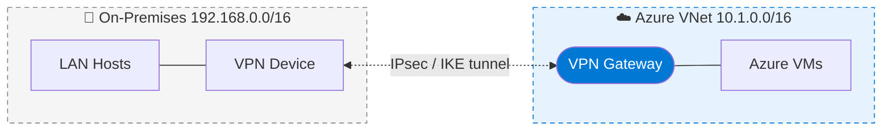

| Property | Value |
|---|---|
| Tunnels | 1 IPsec tunnel |
| Connects | Whole network ↔ VNet |
| Initiated by | VPN device (always-on) |
| Use case | Hybrid cloud, branch office |

---

## 2. VNet-to-VNet VPN

Connects **two Azure VNets** to each other using IPsec tunnels between their respective VPN gateways. Often used to link VNets across regions or subscriptions when peering is not preferred (e.g., for encryption-in-transit guarantees).

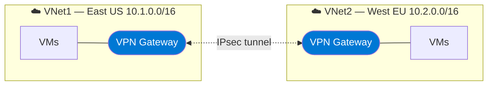

| Property | Value |
|---|---|
| Tunnels | 1 IPsec between gateways |
| Connects | VNet ↔ VNet |
| Cross-region? | Yes |
| Alternative | Global VNet Peering (cheaper, no GW, no encryption by default) |

---

## 3. Point-to-Site VPN (P2S) ✅ The answer to your question

A secure tunnel from a **single client device** into the VNet. The client runs a VPN agent (Azure VPN Client / OpenVPN / SSTP / IKEv2) and gets an IP from the gateway's **client address pool**.

The diagram in your exam question matches this exactly — multiple `VPN client` boxes (172.16.201.11, .12, .13) each with their own `P2S Tunnel` to a single VPN gateway in VNet1.

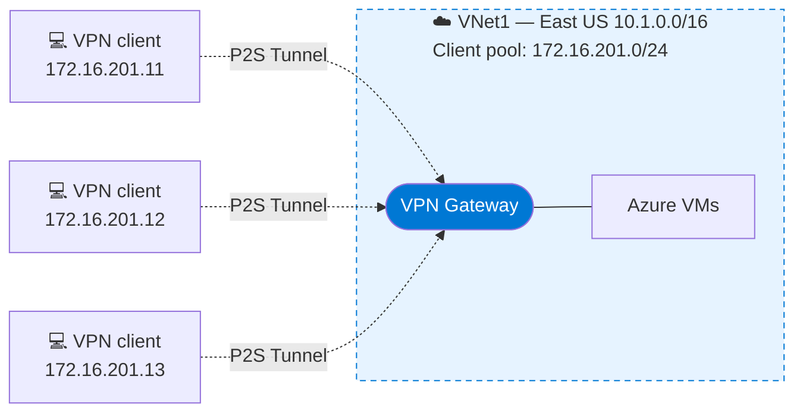

| Property | Value |
|---|---|
| Tunnels | 1 per connected device |
| Connects | Single device ↔ VNet |
| Initiated by | The client (on-demand) |
| Protocols | OpenVPN, SSTP, IKEv2 |
| Auth | Azure certificate, Azure AD, RADIUS |
| Use case | Remote workers, admins from home, ad-hoc access |

**How to spot P2S in a diagram (exam tip):** individual client devices, "P2S Tunnel" labels, and IPs assigned from a non-VNet address pool (e.g. `172.16.x.x` when the VNet is `10.x.x.x`).

---

## 4. DirectAccess — ⚠️ Trap answer

A **legacy Windows Server feature** for transparently connecting domain-joined Windows clients to a corporate intranet. It is **not** an Azure VPN Gateway option — it lives on-premises and Microsoft has effectively deprecated it in favor of Always On VPN and Azure P2S.

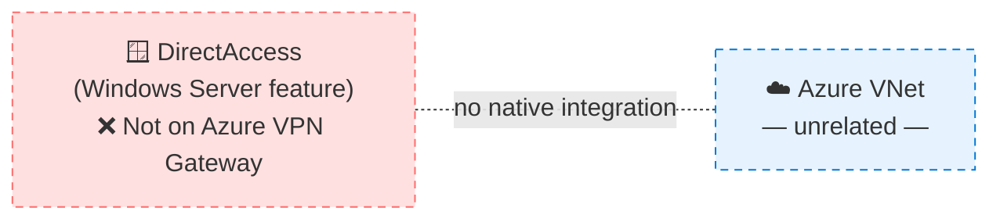

| Property | Value |
|---|---|
| Where it lives | On-prem Windows Server role |
| Status | Deprecated by Microsoft |
| Azure equivalent | Point-to-Site VPN |
| Exam tip | Almost always a wrong answer |

---

## 5. Multi-Site VPN

A variation of S2S where **multiple on-prem sites** connect to the **same** Azure VPN gateway. Requires a **route-based (dynamic) gateway** — policy-based gateways only support a single S2S connection.

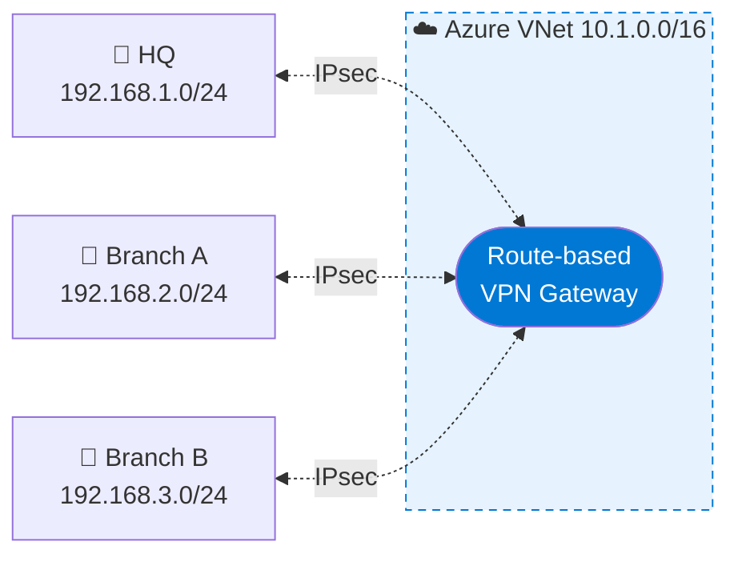

| Property | Value |
|---|---|
| Tunnels | Multiple IPsec into one GW |
| Required GW SKU | Route-based (dynamic) |
| Connects | Many on-prem sites ↔ one VNet |
| Use case | Distributed enterprise |

---

## VPN Quick Comparison

| Option | Connects | Tunnel type | # of tunnels | Initiated by |
|---|---|---|---|---|
| **Site-to-Site** | Network ↔ VNet | IPsec/IKE | 1 | VPN device |
| **VNet-to-VNet** | VNet ↔ VNet | IPsec/IKE | 1 | Either gateway |
| **Point-to-Site** | Device ↔ VNet | OpenVPN / SSTP / IKEv2 | 1 per client | Client |
| **DirectAccess** | *(Not Azure)* | — | — | — |
| **Multi-Site** | Many networks ↔ 1 VNet | IPsec/IKE | Many | VPN devices |

---

# PART 2 — Related Azure Networking Concepts

## 7. Virtual Network (VNet) & Subnets

A **VNet** is a logically isolated network in Azure. You divide it into **subnets** to organize resources and apply different security rules. Some subnets are reserved (e.g., `GatewaySubnet` for VPN/ER gateways, `AzureBastionSubnet` for Bastion).

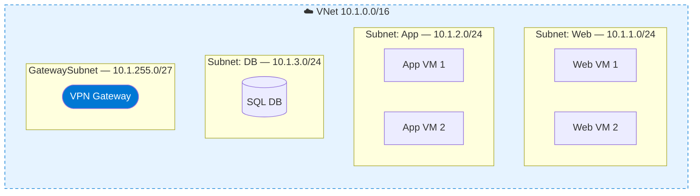

**Key rules:**
- Address space uses **CIDR** notation (e.g., `10.1.0.0/16`).
- Subnets cannot overlap within a VNet, and VNets that connect (peer/VPN) cannot have overlapping ranges.
- Azure reserves the first 4 and last IP of each subnet.
- `GatewaySubnet` must be named exactly that, ideally `/27` or larger.

---

## 8. VNet Peering (vs VNet-to-VNet VPN)

**VNet peering** connects two VNets directly through the Azure backbone — no gateway, no IPsec, low-latency, high-throughput. It's almost always preferable to VNet-to-VNet VPN unless you specifically need encryption between gateways.

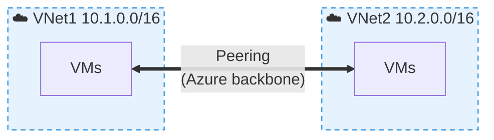

| | **VNet Peering** | **VNet-to-VNet VPN** |
|---|---|---|
| Speed | Backbone speed | Limited by GW SKU |
| Cost | Per-GB only | Gateway hourly + per-GB |
| Encryption | Not by default | IPsec |
| Transitive? | No (use hub-and-spoke + UDR or Virtual WAN) | No |
| Setup | Minutes | ~30+ min per gateway |

---

## 9. VPN Gateway SKUs & Types

Two big distinctions:

**Policy-based vs Route-based**
- *Policy-based:* static, supports only one S2S, IKEv1, no P2S, no multi-site. Legacy.
- *Route-based:* dynamic routing, supports P2S, multi-site, VNet-to-VNet, IKEv2. Use this unless you have a very specific reason not to.

**SKU tiers** (Basic → VpnGw1 → VpnGw2 → VpnGw3 → VpnGw4 → VpnGw5, plus AZ-redundant variants) trade off throughput, max tunnels, and BGP support.

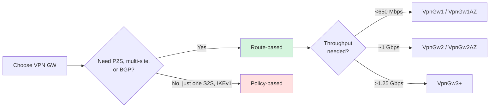

---

## 10. ExpressRoute

A **private, dedicated** connection from your on-prem network into Microsoft's backbone — does **not** traverse the public internet. Higher bandwidth, lower latency, and stronger SLAs than VPN. Used for serious hybrid workloads.

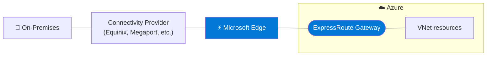

**S2S VPN vs ExpressRoute:**

| | **S2S VPN** | **ExpressRoute** |
|---|---|---|
| Path | Public internet | Private circuit |
| Bandwidth | Up to ~10 Gbps (GW SKU) | Up to 100 Gbps |
| Latency | Variable | Consistently low |
| SLA | 99.9% | 99.95% |
| Setup time | Minutes/hours | Days/weeks |
| Cost | Low | High |

A common pattern is **ExpressRoute + VPN failover** — ExpressRoute as primary, S2S VPN as backup.

---

## 11. Hub-and-Spoke Topology

A reference architecture where a central **hub VNet** holds shared services (firewall, VPN/ER gateway, DNS, Bastion) and **spoke VNets** for workloads peer to the hub. Lets you centralize security/connectivity and isolate workloads.

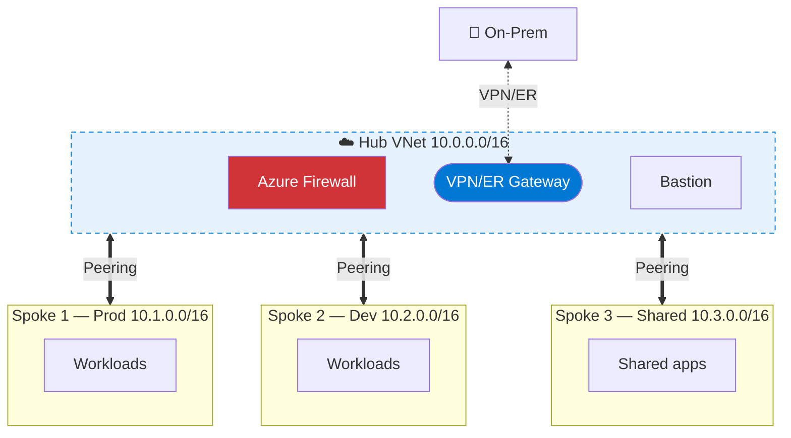

**Why use it:** centralized egress through the firewall, one VPN/ER gateway shared by all spokes (saves money), clean blast-radius isolation between workloads.

> Note: peering is non-transitive. To make spokes talk through the hub, configure **User-Defined Routes (UDRs)** that send spoke traffic through the firewall, or use **Virtual WAN**.

---

## 12. Azure Virtual WAN

A managed networking service that scales hub-and-spoke globally. Microsoft runs the hubs for you; you just connect VNets, branches (S2S/SD-WAN), users (P2S), and ExpressRoute circuits to those hubs.

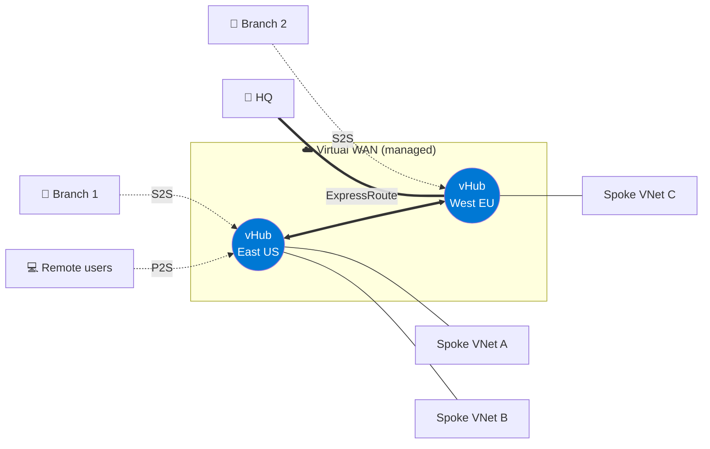

Virtual WAN gives you **transitive routing for free** between branches, users, and VNets — solving the non-transitive limitation of plain peering.

---

## 13. Azure Bastion

A managed PaaS service that provides **RDP/SSH access to your VMs through the Azure portal** — over TLS, with no public IPs on your VMs and no VPN required. Lives in a dedicated `AzureBastionSubnet` (`/26` or larger).

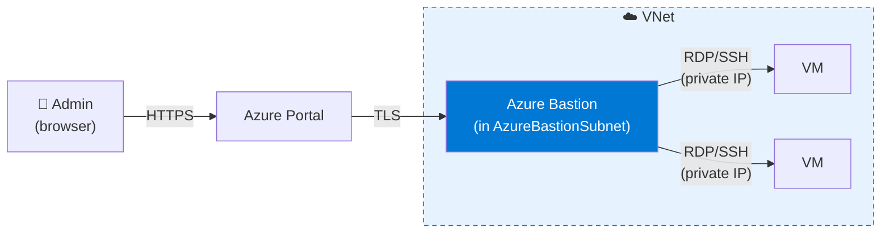

**Wins:** no public IPs on VMs, no NSG rules opening 3389/22 to the internet, MFA via Azure AD, full audit log.

---

## 14. Network Security Groups (NSG)

A **stateful, layer-4 firewall** of allow/deny rules that you attach to subnets and/or NICs. Rules are evaluated in priority order (lower number wins). Default rules allow VNet-internal traffic and outbound internet, deny inbound internet.

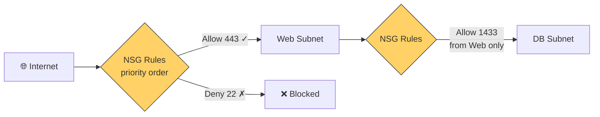

| Rule property | Notes |
|---|---|
| Priority | 100–4096, lowest wins |
| Source / Destination | IP, CIDR, service tag (`Internet`, `VirtualNetwork`, `Storage.EastUS`...), or ASG |
| Port | Single, range, or `*` |
| Protocol | TCP / UDP / ICMP / Any |
| Action | Allow / Deny |

**ASG (Application Security Group)** lets you group VMs by *role* (e.g., `web-servers`) and reference that group in NSG rules instead of IPs.

---

## 15. Azure Firewall

A managed, **stateful Layer-3–7 firewall** with FQDN filtering, threat intelligence, and TLS inspection (Premium SKU). Typically deployed in the hub of a hub-and-spoke topology.

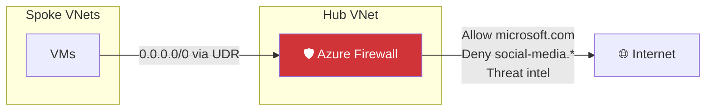

**NSG vs Azure Firewall:**

| | **NSG** | **Azure Firewall** |
|---|---|---|
| Layer | L3/L4 | L3–L7 |
| FQDN filtering | No | Yes |
| Threat intel | No | Yes |
| Cost | Free | Paid (per hour + GB) |
| Scope | Subnet/NIC | Centralized at hub |

You usually use **both together** — NSGs for fine-grained subnet/NIC rules, Azure Firewall for centralized egress and L7 policy.

---

## 16. Decision cheat-sheet

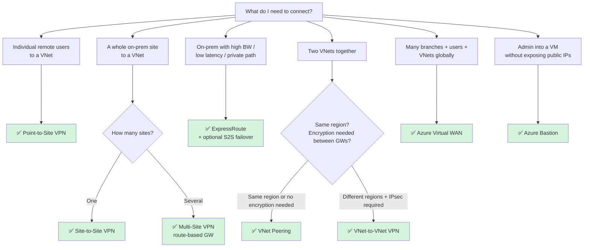

---

## TL;DR for the original exam question

The diagram in your screenshot shows **multiple individual VPN clients** (172.16.201.11/12/13) each connecting through their own **P2S Tunnel** to a single VPN gateway in VNet1. The address pool `172.16.201.0/24` is a P2S **client address pool**. This is the textbook fingerprint of:

> ### ✅ **C. Configure a Point-to-Site VPN**

Distractors:
- **A. Site-to-Site** would show a single on-prem network with a VPN device, not individual clients.
- **B. VNet-to-VNet** would show *two* VNets with two gateways.
- **D. DirectAccess** isn't an Azure VPN gateway feature at all.
- **E. Multi-Site** would show multiple on-prem sites converging on one gateway.

azure

Virual network 

nsg: used to conrol the trafic to azure resource

In Amazon Web Services (AWS), the equivalent of an Azure Network Interface (NIC) is the Elastic Network Interface (ENI). 

Key Comparison: ENI vs. Azure NIC
While they perform the same basic function, there are slight differences in how you interact with them:
Feature 	AWS Elastic Network Interface (ENI)	Azure Network Interface (NIC)
Primary Use	Attached to EC2 instances to provide network connectivity.	Attached to Azure VMs to provide network connectivity.
IP Addresses	Can have a primary private IP, multiple secondary private IPs, and Elastic IPs.	Can have multiple IP configurations, each with private and public IPs.
Security	Associated with AWS Security Groups.	Associated with Azure Network Security Groups (NSGs).
MAC Address	Includes a fixed MAC address that stays with the ENI even if moved between instances.	Includes a MAC address assigned at creation.
Detaching	Can be hot-attached or detached from instances (if it's not the primary interface).	Can be added or removed from VMs, though some restrictions apply based on the VM state.

# Storage Service

Blob Storage is the direct alternative to AWS S3, not EBS. 
Both are object storage services designed to store unstructured files like images, logs, and backups. [2, 3, 4] 
The confusion often arises because Azure Blob Storage is split into different "sub-types" behind the scenes, and Azure handles its virtual hard disks a bit differently than AWS. [5, 6] 
Here is the quick breakdown to clear up the confusion.
------------------------------
## 🗺️ The Actual Equivalent Services
The real map between AWS and Azure storage is:

* 🗃️ Object Storage: AWS S3 $\leftrightarrow$ Azure Blob Storage
* 💽 Block Storage: AWS EBS $\leftrightarrow$ Azure Managed Disks (Compute disks attached to VMs)
* 📁 File Storage: AWS EFS $\leftrightarrow$ Azure Files (Shared network drives) [3, 6, 7] 
* 

------------------------------
## 🤔 Why Do People Connect Blob to EBS?
There are two technical reasons why Azure Blob storage is sometimes mentioned alongside EBS:
## 1. Page Blobs vs. Block Blobs
Inside Azure Blob storage, there are different types of blobs: [5] 

* Block Blobs: Used for standard files (This is the exact match to S3).
* Page Blobs: Optimized for random read/write operations. Azure uses Page Blobs to store the virtual hard disk (.vhd) files that back Azure Virtual Machines. Because they act as the backend for VM disks, people sometimes associate them with AWS EBS. [4, 5, 8, 9] 
* 

## 2. AWS S3 Powers EBS Snapshots
On the AWS side, when you take a backup snapshot of an EBS block volume, AWS automatically saves that raw snapshot into Amazon S3 in the background. [10] 
------------------------------
## ⚖️ Summary of the Differences

| Feature [1, 5, 6, 11, 12] | AWS EBS / Azure Managed Disks | AWS S3 / Azure Blob Storage |
|---|---|---|
| Storage Type | Block Storage | Object Storage |
| Primary Use | OS boot drives, live databases | App data, media files, backups |
| Accessibility | Must be attached to a specific VM | Accessible anywhere via internet URL |

