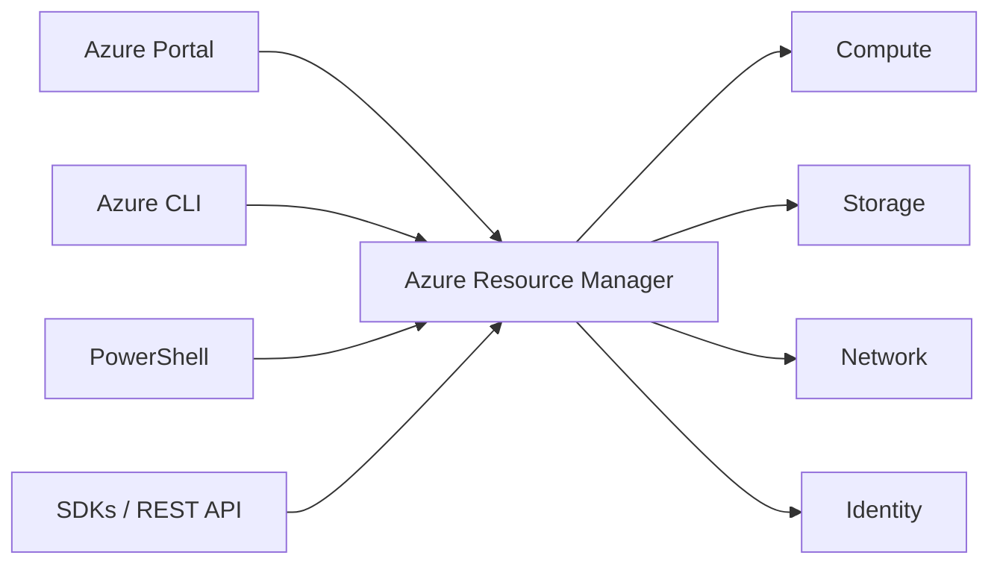
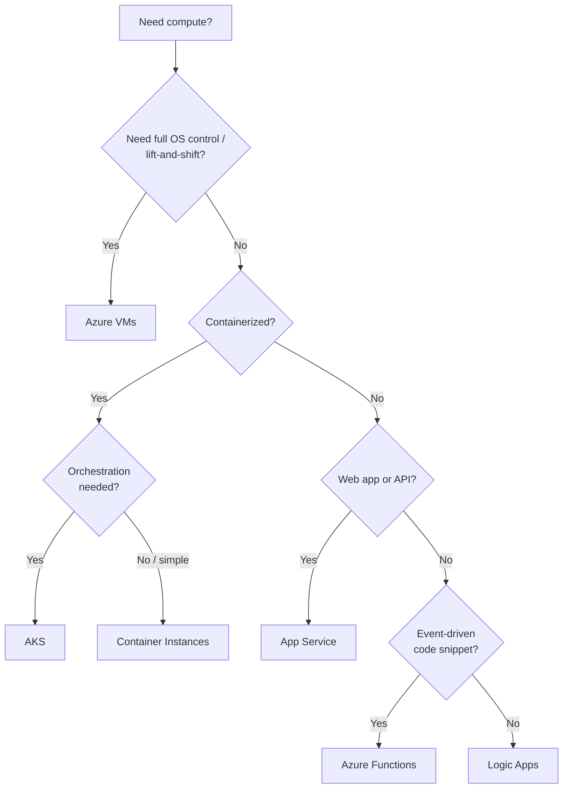
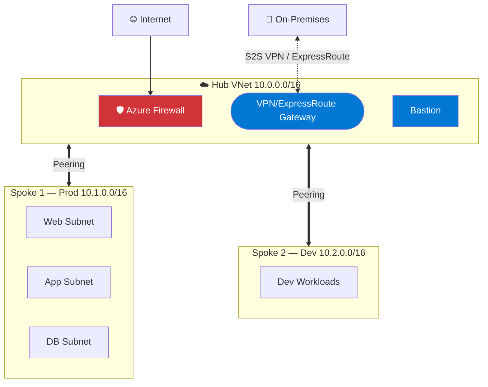
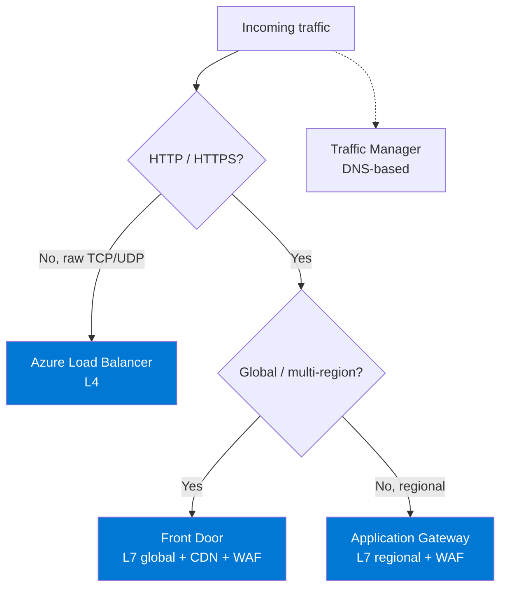
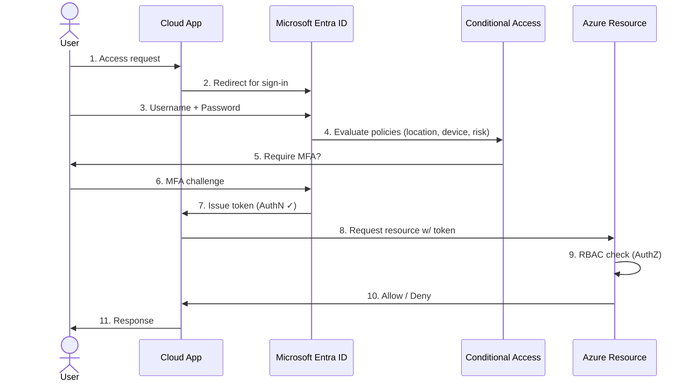
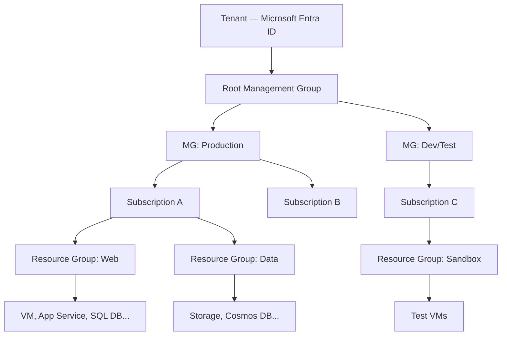
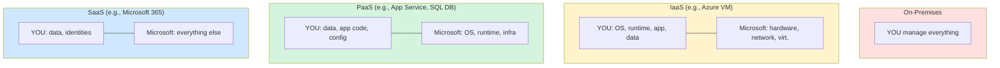
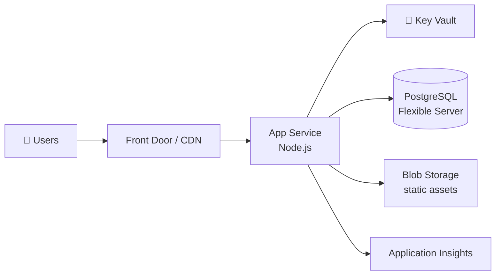

# AZ-900: Microsoft Azure Fundamentals — Complete Study Guide

> A single-source-of-truth study guide. No external resources required.
> Beginner-friendly, technically precise, with AWS equivalents throughout for engineers from a DevOps/AWS background.

---

## Table of Contents

1. [Introduction](#1-introduction)
2. [Azure Core Concepts](#2-azure-core-concepts)
3. [Azure Architecture & Hierarchy](#3-azure-architecture--hierarchy)
4. [Compute Services](#4-compute-services)
5. [Networking Services](#5-networking-services)
6. [Storage Services](#6-storage-services)
7. [Database Services](#7-database-services)
8. [Identity, Security & Compliance](#8-identity-security--compliance)
9. [Pricing & Cost Management](#9-pricing--cost-management)
10. [Governance & Manageability](#10-governance--manageability)
11. [Management Tools](#11-management-tools)
12. [Key Diagrams](#12-key-diagrams)
13. [Azure ↔ AWS Master Comparison](#13-azure--aws-master-comparison)
14. [Real-World Scenarios](#14-real-world-scenarios)
15. [Exam Tips & Traps](#15-exam-tips--traps)
16. [Practice Questions (35+)](#16-practice-questions-35)
17. [Final Cheat-Sheet](#17-final-cheat-sheet)

---

# 1. Introduction

## What is AZ-900?

**AZ-900: Microsoft Azure Fundamentals** is the entry-level Microsoft certification for Azure. It validates foundational knowledge of cloud concepts, core Azure services, security, governance, privacy, compliance, pricing, and Service Level Agreements (SLAs).

It is **not** a deep technical exam — it tests *conceptual* understanding and the ability to *recognize* what each Azure service does and when to use it.

## Who should take it?

- Beginners starting their cloud journey
- DevOps / SysAdmins from AWS or GCP needing a baseline of Azure
- Sales, project managers, and non-technical staff working with cloud projects
- Anyone planning to attempt AZ-104 (Administrator) or AZ-204 (Developer) — AZ-900 is a recommended foundation

## Exam Format

| Aspect | Detail |
|---|---|
| Number of questions | 40–60 |
| Duration | 45 minutes (≈ 60 min seat time) |
| Passing score | 700 / 1000 (scaled, ~70%) |
| Question types | Multiple choice, multiple response, drag-and-drop, hotspot, case study |
| Cost | ~$99 USD (varies by region; student/voucher discounts available) |
| Validity | Lifetime (Fundamentals certs do **not** expire) |
| Languages | English, Japanese, Chinese, Korean, German, French, Spanish, Portuguese, Russian, Arabic, Indonesian, Italian |

## Domain Weightage (current)

| Domain | Weight |
|---|---|
| Describe cloud concepts | 25–30% |
| Describe Azure architecture and services | 35–40% |
| Describe Azure management and governance | 30–35% |

## Top Exam Tips

1. **Eliminate wrong answers first.** Azure exams love distractors that are technically valid but irrelevant to the question.
2. **Watch for keywords:** "single point of failure" → Availability Zones; "encrypted at rest" → Storage Service Encryption; "least privilege" → RBAC.
3. **Don't over-engineer.** If a simple service answers the question, it's probably the right answer.
4. **Mark and review:** you can flag questions and come back. Use this aggressively.
5. **No deductions** for wrong answers — *always guess* if unsure.
6. **Case studies** appear at the end; they take longer — manage your time.
7. **The exam updates regularly.** Microsoft Entra ID is the new name for Azure AD; both names may appear.

---

# 2. Azure Core Concepts

## 2.1 What is Cloud Computing?

**Definition:** On-demand delivery of compute, storage, networking, databases, and software over the internet, with pay-as-you-go pricing.

**Analogy:** Like electricity. You don't own a power plant — you plug in and pay for what you use. Cloud is the same: you don't own data centers; you consume compute as a metered utility.

**Practical example:** Instead of buying a $5,000 server to host a website, you rent an Azure VM for $0.10/hour. Turn it off when not in use → pay nothing.

---

## 2.2 Cloud Deployment Models

| Model | Description | Example | Pros | Cons |
|---|---|---|---|---|
| **Public** | Owned by a cloud provider, shared infra | Azure, AWS | Cheap, scalable, no maintenance | Less control, shared tenancy |
| **Private** | Single organization, on-prem or hosted | Azure Stack, VMware | Full control, compliance | Expensive, you maintain it |
| **Hybrid** | Mix of public + private | On-prem AD synced to Microsoft Entra ID | Flexibility, gradual migration | Complex networking |
| **Multi-cloud** | Multiple public clouds | Azure + AWS | No vendor lock-in | Operational overhead |

**Analogy:**
- *Public* = renting an apartment (shared building)
- *Private* = owning a house (yours alone)
- *Hybrid* = own a house but rent storage units when you need extra space

---

## 2.3 Cloud Service Models (IaaS / PaaS / SaaS)

```
                YOU MANAGE       PROVIDER MANAGES
On-Premises:    [Everything]            -
IaaS:          [App + OS + Data]       [Hardware + Virtualization + Network]
PaaS:          [App + Data]            [OS + Runtime + Hardware + Network]
SaaS:          [Data + Settings]       [Everything else]
```

| Model | What you manage | Azure example | AWS equivalent | Analogy |
|---|---|---|---|---|
| **IaaS** | OS, runtime, app, data | Azure VM | EC2 | Renting a car |
| **PaaS** | App + data only | App Service, Azure SQL | Elastic Beanstalk, RDS | Taking a taxi |
| **SaaS** | Just use it | Microsoft 365, Dynamics 365 | Workspaces (sort of) | Public bus |

**Real-world example:**
- *IaaS:* You spin up an Ubuntu VM, install Node.js, deploy your app, configure backups.
- *PaaS:* You push code to Azure App Service. Azure handles OS patches, scaling, runtime.
- *SaaS:* You log into Outlook.com. Microsoft handles literally everything.

---

## 2.4 Benefits of Cloud Computing

### High Availability (HA)
**Definition:** System remains operational with minimal downtime.
**Azure mechanism:** Availability Zones, Availability Sets, geo-replication.
**SLA example:** A VM with two instances across Availability Zones gets 99.99% SLA.

### Scalability
**Definition:** Ability to increase resources to meet demand.
- **Vertical scaling (scale up):** Bigger VM (more CPU/RAM). Has a ceiling.
- **Horizontal scaling (scale out):** More VMs. Effectively unlimited.

```
Vertical Scaling (Scale Up):       Horizontal Scaling (Scale Out):
   ┌─────┐    ┌──────────┐            ┌───┐         ┌───┐ ┌───┐ ┌───┐
   │ VM  │ →  │   VM     │            │VM │   →     │VM │ │VM │ │VM │
   │ 2CPU│    │  8 CPU   │            └───┘         └───┘ └───┘ └───┘
   └─────┘    └──────────┘            1 inst         3 inst
```

### Elasticity
**Definition:** Auto-scale up *and down* based on real-time demand.
**Example:** An e-commerce site auto-scales to 50 VMs on Black Friday, drops to 5 on Tuesday.
> *Scalability = capacity to grow. Elasticity = automatic, dynamic adjustment.*

### Reliability
**Definition:** System can recover from failures and continue operating.
**Azure mechanism:** Region pairs, geo-redundant storage, backups.

### Predictability
- **Performance predictability:** Auto-scaling, load balancing.
- **Cost predictability:** Cost Management, pricing calculator, reservations.

### Security
Provider-managed physical security, plus tools like Microsoft Defender for Cloud, Key Vault, RBAC.

### Governance
Standards via Azure Policy, Blueprints, RBAC, tagging.

### Manageability
- *Manageability of the cloud:* monitoring, automation (templates, alerts).
- *Manageability in the cloud:* portal, CLI, PowerShell, REST API.

---

## 2.5 CapEx vs OpEx

| | **CapEx (Capital Expenditure)** | **OpEx (Operating Expenditure)** |
|---|---|---|
| Definition | Upfront purchase of physical assets | Ongoing pay-as-you-go expenses |
| Example | Buy 10 servers for $100k | Rent VMs at $0.10/hr |
| Tax | Depreciated over years | Deducted in same year |
| Cloud model? | **On-premises** | **Cloud** |
| Risk | High (over/under-provisioning) | Low (scale on demand) |

**Analogy:** CapEx = buying a car. OpEx = using Uber.

> **Exam tip:** Cloud = OpEx. On-prem = CapEx. Memorize this.

---

## 2.6 Consumption-Based Pricing

You pay only for what you use — by the second, hour, GB, or transaction. No upfront cost, no idle waste.

**Example:** A function app that runs 1M times/month at $0.20 per million executions = $0.20/month.

---

## 2.7 Shared Responsibility Model

Cloud security is a *partnership* between you and Azure. The line moves depending on the service model.

```
                  ON-PREM   IaaS    PaaS    SaaS
Data & Access      YOU      YOU     YOU     YOU
Apps               YOU      YOU     YOU     MS
Runtime            YOU      YOU     MS      MS
OS                 YOU      YOU     MS      MS
Virtualization     YOU      MS      MS      MS
Servers            YOU      MS      MS      MS
Storage            YOU      MS      MS      MS
Network            YOU      MS      MS      MS
Physical           YOU      MS      MS      MS
```

**Always your responsibility (regardless of model):**
- Your data
- Your endpoints (devices)
- Your accounts and identities
- Access management

**Always Microsoft's responsibility:**
- Physical security of datacenters
- Physical hosts and network

---

# 3. Azure Architecture & Hierarchy

## 3.1 Geography → Region → Availability Zone → Datacenter

```
Geography (e.g., United States)
    │
    └── Region (e.g., East US)
            │
            └── Availability Zone 1 ──── Datacenter(s)
            └── Availability Zone 2 ──── Datacenter(s)
            └── Availability Zone 3 ──── Datacenter(s)
```

### Region
A set of datacenters in a geographic area, connected by a low-latency network. **60+** regions worldwide.

### Availability Zone (AZ)
A physically separate datacenter within a region with independent power, cooling, and network. Latency between zones is < 2 ms.

- **At least 3 AZs** per supported region
- Deploying across AZs protects against datacenter failure
- VMs across AZs → **99.99% SLA**

### Region Pairs
Each region is paired with another in the same geography (e.g., East US ↔ West US). Used for geo-redundancy.

**Benefits:**
- Updates rolled out one region at a time per pair
- Prioritized recovery during outages
- At least 300+ miles apart (data residency-friendly)

### Sovereign / Special Regions
- **Azure Government** (US gov workloads)
- **Azure China** (operated by 21Vianet)
- **Azure Germany** (now retired, mentioned for context)

---

## 3.2 Azure Resource Hierarchy

```
┌──────────────────────────────────────────────┐
│ Tenant (Microsoft Entra ID directory)        │
│  ┌────────────────────────────────────────┐  │
│  │ Root Management Group                  │  │
│  │  ├── Management Group (Prod)           │  │
│  │  │    ├── Subscription A               │  │
│  │  │    │    ├── Resource Group: Web     │  │
│  │  │    │    │   ├── VM, App Service,    │  │
│  │  │    │    │   │  SQL DB, Storage…     │  │
│  │  │    │    └── Resource Group: Data    │  │
│  │  │    └── Subscription B               │  │
│  │  └── Management Group (Dev/Test)       │  │
│  │       └── Subscription C               │  │
│  └────────────────────────────────────────┘  │
└──────────────────────────────────────────────┘
```

| Level | Purpose |
|---|---|
| **Tenant** | A Microsoft Entra ID directory — the identity boundary |
| **Management Group** | Container for multiple subscriptions; apply policies/RBAC at scale |
| **Subscription** | Billing & access boundary; resources are billed per subscription |
| **Resource Group (RG)** | Logical container for related resources (lifecycle group) |
| **Resource** | The actual thing: VM, DB, VNet, etc. |

### Important rules
- A resource lives in exactly **one resource group** at a time.
- Resource group can contain resources from multiple regions, but the RG itself has a metadata location.
- Deleting an RG deletes **all** resources inside it.
- Policies/RBAC inherit downward (Management Group → Subscription → RG → Resource).

---

## 3.3 Azure Resource Manager (ARM)

**ARM** is the deployment and management layer for Azure. Every action you take — via portal, CLI, PowerShell, REST API — is funneled through ARM.



**Capabilities:**
- Deploy, manage, monitor as a group via ARM templates (JSON) or Bicep
- Apply tags, RBAC, policies, locks consistently
- Idempotent declarative deployments

**AWS equivalent:** AWS CloudFormation / AWS Resource Groups.

---

# 4. Compute Services

## 4.1 Azure Virtual Machines (VMs)

| Attribute | Detail |
|---|---|
| **What** | IaaS — full Windows/Linux VMs you control |
| **Why** | Lift-and-shift, custom software, full OS control |
| **How** | Choose image, size (D-series, B-series, etc.), disk, networking, deploy |
| **Pricing** | Per second; pay-as-you-go, Reserved (1/3-yr), Spot |
| **AWS equivalent** | **EC2** |

**SLA:**
- Single VM with Premium SSD: 99.9%
- VMs in an Availability Set: 99.95%
- VMs across Availability Zones: 99.99%

**VM Series cheat sheet:**

| Series | Purpose |
|---|---|
| **B** | Burstable (dev/test, low CPU baseline) |
| **D** | General purpose |
| **E** | Memory-optimized |
| **F** | Compute-optimized |
| **L** | Storage-optimized |
| **N** | GPU (AI/graphics) |
| **H** | High-performance compute |
| **M** | Massive memory (SAP HANA) |

---

## 4.2 VM Scale Sets (VMSS)

| Attribute | Detail |
|---|---|
| **What** | Group of identical, load-balanced VMs that auto-scale |
| **Why** | Stateless workloads needing horizontal scaling (web tiers) |
| **How** | Define VM template + scaling rules (CPU/schedule) |
| **AWS equivalent** | **Auto Scaling Group + Launch Template** |

---

## 4.3 Azure App Service

| Attribute | Detail |
|---|---|
| **What** | PaaS for hosting web apps, APIs, mobile backends |
| **Why** | Skip OS management; built-in scaling, deployment slots, custom domains, SSL |
| **How** | Deploy code (Git, ZIP, container) → App Service runs it on managed infra |
| **Plans** | Free, Shared, Basic, Standard, Premium, Isolated |
| **AWS equivalent** | **Elastic Beanstalk** (closest), AWS App Runner |

**Key features:**
- Auto-scale (Standard+ tier)
- **Deployment slots** — staging environments with swap (zero-downtime release)
- Built-in CI/CD with GitHub Actions, Azure DevOps
- Supports .NET, Node.js, Python, Java, PHP, Ruby, custom containers

---

## 4.4 Azure Container Instances (ACI)

| Attribute | Detail |
|---|---|
| **What** | Run a single container without managing servers/orchestrator |
| **Why** | Fast, simple, short-lived workloads; batch jobs |
| **How** | `az container create` → container runs in seconds |
| **AWS equivalent** | **AWS Fargate** (with ECS), or AWS App Runner |

> Use ACI for *simple* containerized apps. For orchestration → AKS.

---

## 4.5 Azure Kubernetes Service (AKS)

| Attribute | Detail |
|---|---|
| **What** | Managed Kubernetes — control plane is free, you pay for worker nodes |
| **Why** | Microservices, complex container orchestration |
| **How** | Define cluster, deploy via `kubectl` / Helm |
| **AWS equivalent** | **EKS** |

**You manage:** worker nodes, app deployments.
**Azure manages:** the Kubernetes control plane (masters).

---

## 4.6 Azure Functions

| Attribute | Detail |
|---|---|
| **What** | Serverless compute — event-driven code, no server management |
| **Why** | Glue services, lightweight APIs, scheduled tasks, event handlers |
| **How** | Trigger (HTTP, queue, timer) → run code → scale automatically |
| **Pricing** | Pay per execution (Consumption plan): GB-seconds + executions |
| **AWS equivalent** | **AWS Lambda** |

**Plans:**
- *Consumption* — pay-per-use, scale to zero
- *Premium* — pre-warmed instances, VNet integration
- *Dedicated* — runs on App Service Plan

---

## 4.7 Azure Logic Apps

| Attribute | Detail |
|---|---|
| **What** | Low-code/no-code workflow automation |
| **Why** | Connect SaaS systems with visual designer (e.g., new email → Slack message) |
| **AWS equivalent** | **AWS Step Functions** + EventBridge |

---

## 4.8 Azure Virtual Desktop (AVD)

| Attribute | Detail |
|---|---|
| **What** | Hosted Windows desktops in Azure |
| **Why** | VDI for remote workforce; multi-session Windows 10/11 |
| **AWS equivalent** | **AWS WorkSpaces / AppStream 2.0** |

---

## 4.9 Compute Decision Tree



---

# 5. Networking Services

## 5.1 Virtual Network (VNet)

| Attribute | Detail |
|---|---|
| **What** | Logically isolated network in Azure (your own private network) |
| **Why** | Foundation for any networking; isolates and segments resources |
| **How** | Define address space (CIDR) → divide into subnets → attach resources |
| **AWS equivalent** | **VPC** |

**Rules:**
- Address space uses RFC1918 private ranges (10.x, 172.16-31.x, 192.168.x)
- Cannot overlap with peered/VPN-connected networks
- Subnets can't span VNets; VNets can't span regions (but can peer)

---

## 5.2 Subnets

A subnet is a range within the VNet's address space. Used for segmentation and applying NSGs/route tables.

**Reserved subnets (named exactly):**
- `GatewaySubnet` — for VPN/ExpressRoute Gateway (≥ /27)
- `AzureBastionSubnet` — for Bastion (≥ /26)
- `AzureFirewallSubnet` — for Azure Firewall (≥ /26)

---

## 5.3 VNet Peering

| Attribute | Detail |
|---|---|
| **What** | Direct, low-latency connection between two VNets via Microsoft backbone |
| **Why** | Faster and cheaper than VNet-to-VNet VPN |
| **Types** | Regional (same region), Global (cross-region) |
| **Limit** | Non-transitive — A↔B and B↔C does NOT mean A↔C |
| **AWS equivalent** | **VPC Peering** |

---

## 5.4 VPN Gateway

| Attribute | Detail |
|---|---|
| **What** | Encrypted IPsec/IKE tunnel to/from Azure |
| **Types** | Site-to-Site, Point-to-Site, VNet-to-VNet, Multi-Site |
| **AWS equivalent** | **VPN Gateway / Site-to-Site VPN** |

(See the [VPN diagram section](#12-key-diagrams) for visuals.)

---

## 5.5 ExpressRoute

| Attribute | Detail |
|---|---|
| **What** | Private, dedicated connection from on-prem to Azure (does NOT use the public internet) |
| **Why** | Mission-critical workloads, predictable latency, up to 100 Gbps |
| **How** | Through a connectivity provider (Equinix, Megaport, etc.) |
| **AWS equivalent** | **AWS Direct Connect** |

---

## 5.6 Azure Load Balancer

| Attribute | Detail |
|---|---|
| **What** | Layer-4 (TCP/UDP) load distribution across healthy VMs |
| **Types** | Public (internet-facing), Internal (private) |
| **AWS equivalent** | **Network Load Balancer (NLB)** |

---

## 5.7 Application Gateway

| Attribute | Detail |
|---|---|
| **What** | Layer-7 (HTTP/HTTPS) load balancer with WAF, URL routing, SSL offload |
| **Why** | Web traffic — cookie-based session affinity, path-based routing |
| **AWS equivalent** | **Application Load Balancer (ALB) + AWS WAF** |

---

## 5.8 Azure Front Door

| Attribute | Detail |
|---|---|
| **What** | Global Layer-7 entry point with CDN, WAF, SSL, anycast routing |
| **Why** | Multi-region web apps, fast global access |
| **AWS equivalent** | **CloudFront + Global Accelerator + WAF** |

---

## 5.9 Traffic Manager

| Attribute | Detail |
|---|---|
| **What** | DNS-based traffic distribution across regions |
| **Routing methods** | Performance, Priority, Weighted, Geographic, MultiValue, Subnet |
| **AWS equivalent** | **Route 53 (with routing policies)** |

> Front Door = HTTP-aware (Layer 7). Traffic Manager = DNS-only.

---

## 5.10 Azure DNS

| Attribute | Detail |
|---|---|
| **What** | Managed DNS hosting service for your domains |
| **AWS equivalent** | **Route 53 (hosted zones)** |

---

## 5.11 Azure CDN

| Attribute | Detail |
|---|---|
| **What** | Caches static content at edge POPs globally |
| **AWS equivalent** | **CloudFront** |

> Microsoft is consolidating CDN into Azure Front Door (Standard/Premium); legacy Azure CDN profiles still exist.

---

## 5.12 Azure Bastion

| Attribute | Detail |
|---|---|
| **What** | Browser-based RDP/SSH to VMs without public IPs |
| **Why** | Eliminate public IP + NSG rules opening 22/3389 |
| **AWS equivalent** | **AWS Systems Manager Session Manager** |

---

## 5.13 Azure Firewall

| Attribute | Detail |
|---|---|
| **What** | Managed stateful Layer-3-7 firewall as a service |
| **Why** | Centralized policy, FQDN filtering, threat intel |
| **AWS equivalent** | **AWS Network Firewall** |

---

## 5.14 Networking Cheat Comparison

| Need | Azure | AWS |
|---|---|---|
| Private network | VNet | VPC |
| Connect VNets | VNet Peering / VPN | VPC Peering / Transit Gateway |
| Site-to-cloud private link | ExpressRoute | Direct Connect |
| L4 load balance | Load Balancer | NLB |
| L7 load balance | Application Gateway | ALB |
| Global edge LB | Front Door | CloudFront + Global Accelerator |
| DNS | Azure DNS | Route 53 |
| CDN | Front Door / CDN | CloudFront |
| Jump-host | Bastion | SSM Session Manager |
| Managed firewall | Azure Firewall | Network Firewall |

---

# 6. Storage Services

## 6.1 Azure Storage Account

A storage account is the top-level container providing a unique namespace. Inside it: Blob, File, Queue, Table, Disk.

**Naming:** Globally unique, 3–24 chars, lowercase + numbers only.

---

## 6.2 The 5 Storage Data Services

| Service | What | Use case | AWS equivalent |
|---|---|---|---|
| **Blob** | Object store (binary/text) | Backups, images, video, big data | **S3** |
| **File** | Managed SMB/NFS file share | Lift-and-shift file servers | **EFS / FSx** |
| **Queue** | Message queue | Decouple async components | **SQS** |
| **Table** | NoSQL key-value | Structured non-relational data | **DynamoDB** (basic) |
| **Disk** | Block storage attached to VMs | OS / data disks | **EBS** |

> For modern NoSQL needs, prefer **Cosmos DB** over Table Storage.

---

## 6.3 Blob Storage Tiers

| Tier | Use case | Access cost | Storage cost | Min retention |
|---|---|---|---|---|
| **Hot** | Frequent access | Low | High | None |
| **Cool** | Infrequent (≥ 30 days) | Medium | Low | 30 days |
| **Cold** | Rare access (≥ 90 days) | Higher | Lower | 90 days |
| **Archive** | Backup/compliance (≥ 180 days) | Highest | Lowest | 180 days |

> **Archive is offline.** Rehydration takes hours.

**AWS comparison:**
- Hot ↔ S3 Standard
- Cool ↔ S3 Standard-IA
- Cold ↔ S3 Glacier Instant Retrieval
- Archive ↔ S3 Glacier Deep Archive

---

## 6.4 Storage Redundancy

| Type | Copies | Where | Failure tolerance |
|---|---|---|---|
| **LRS** (Locally Redundant) | 3 | Same datacenter | Disk/server failure |
| **ZRS** (Zone Redundant) | 3 | 3 AZs in 1 region | Zone failure |
| **GRS** (Geo Redundant) | 6 | Primary + paired region (LRS×2) | Region failure |
| **RA-GRS** | 6 | Like GRS + read access to secondary | Region failure |
| **GZRS** | 6 | ZRS in primary + LRS in paired | Region failure with zone HA |
| **RA-GZRS** | 6 | GZRS + read access to secondary | Strongest |

```
LRS:    [DC1: copy1, copy2, copy3]
ZRS:    [AZ1, AZ2, AZ3] (one copy each)
GRS:    [Region1: LRS] + [Region2: LRS]
GZRS:   [Region1: ZRS] + [Region2: LRS]
```

---

## 6.5 Azure Files vs Blob

| | **Files** | **Blob** |
|---|---|---|
| Protocol | SMB / NFS / REST | REST (HTTPS) |
| Mount? | Yes (like a network drive) | No |
| Use case | Shared file system | Object/static content |

---

## 6.6 Migration & Data Transfer Services

| Service | Use |
|---|---|
| **Azure Migrate** | Discover, assess, migrate on-prem servers, DBs, apps |
| **Azure Data Box** | Physical appliance for offline bulk data transfer (TBs–PBs) |
| **AzCopy** | CLI for fast Blob/File transfers |
| **Storage Explorer** | GUI desktop tool |
| **Azure File Sync** | Cache cloud file share on-prem servers |

**AWS equivalents:** AWS Migration Hub, AWS Snowball / Snowmobile, AWS DataSync.

---

# 7. Database Services

## 7.1 Database Options Map

```
                       ┌─ Azure SQL Database (PaaS, MS SQL)
                       ├─ Azure SQL Managed Instance
        Relational ────┼─ SQL Server on Azure VM (IaaS)
                       ├─ Azure DB for MySQL
                       └─ Azure DB for PostgreSQL / MariaDB

                       ┌─ Cosmos DB (multi-model: doc/key-value/graph/column)
        NoSQL    ──────┼─ Table Storage (basic key-value)
                       └─ Cosmos DB for MongoDB / Cassandra

   Big Data /         ┌─ Azure Synapse Analytics (data warehouse)
   Analytics    ──────┼─ Azure Data Lake Storage Gen2
                      ├─ HDInsight (Hadoop/Spark)
                      └─ Databricks (Spark)

   Cache       ──────── Azure Cache for Redis
```

---

## 7.2 Azure SQL Database

| Attribute | Detail |
|---|---|
| **What** | Fully managed Microsoft SQL Server PaaS |
| **Why** | Skip patching/backups/HA setup; built-in 99.99% SLA |
| **AWS equivalent** | **RDS for SQL Server / Aurora** |

**Tiers:** DTU-based (Basic/Standard/Premium) or vCore-based (more flexible).

---

## 7.3 Azure SQL Managed Instance

Closer to on-prem SQL Server (supports SQL Agent, cross-DB queries, CLR). Best for lift-and-shift.

---

## 7.4 SQL Server on Azure VM

Pure IaaS. You install and manage SQL Server yourself. Use only when you need full OS access (e.g., specific extensions, software).

---

## 7.5 Azure Cosmos DB

| Attribute | Detail |
|---|---|
| **What** | Globally distributed, multi-model NoSQL DB |
| **Why** | Single-digit ms latency, 99.999% SLA, turnkey global replication |
| **APIs** | NoSQL (Core), MongoDB, Cassandra, Gremlin, Table |
| **Consistency** | 5 levels: Strong, Bounded Staleness, Session, Consistent Prefix, Eventual |
| **AWS equivalent** | **DynamoDB** (closest), DocumentDB |

---

## 7.6 Azure DB for MySQL / PostgreSQL / MariaDB

Managed open-source databases with patching, backups, HA, scaling handled by Azure.

**AWS equivalent:** RDS for MySQL / PostgreSQL / Aurora.

---

## 7.7 Azure Synapse Analytics

| Attribute | Detail |
|---|---|
| **What** | Unified data warehouse + big data analytics |
| **AWS equivalent** | **Redshift** + Athena + Glue (combined) |

---

## 7.8 Azure Cache for Redis

| Attribute | Detail |
|---|---|
| **What** | In-memory key-value cache (managed Redis) |
| **AWS equivalent** | **ElastiCache for Redis** |

---

# 8. Identity, Security & Compliance

## 8.1 Microsoft Entra ID (formerly Azure AD)

| Attribute | Detail |
|---|---|
| **What** | Cloud-based identity & access management service |
| **Why** | SSO, MFA, conditional access, B2B/B2C |
| **AWS equivalent** | **AWS IAM Identity Center / IAM** |

> **Azure AD has been renamed to Microsoft Entra ID** (since 2023). The service hasn't changed; only the brand name. Both names appear on the exam.

**Key concepts:**
- **Tenant** — your dedicated Entra ID instance
- **Identity** — user, group, service principal, managed identity
- **SSO** — sign in once, access everything
- **B2B** — invite external partners (guest users)
- **B2C** — external customer identity for your apps

---

## 8.2 Authentication vs Authorization

| | Authentication (AuthN) | Authorization (AuthZ) |
|---|---|---|
| Question | "Who are you?" | "What can you do?" |
| Mechanism | Password, MFA, biometrics | RBAC, policies |
| Order | Happens first | Happens after AuthN |

---

## 8.3 Multi-Factor Authentication (MFA)

Two or more of:
1. Something you **know** (password)
2. Something you **have** (phone, token)
3. Something you **are** (fingerprint, face)

Free for Microsoft Entra ID via **security defaults**; advanced controls need P1/P2 or per-user MFA license.

---

## 8.4 Conditional Access

Policy-based access control: *"If user is in HR group AND signing in from outside the corporate network, require MFA."*

Signals: user, group, location (IP/country), device state, app, risk level.
Decisions: block / grant / require MFA / require compliant device.

**Requires:** Microsoft Entra ID **P1** or higher.

---

## 8.5 Passwordless Authentication

Options: Windows Hello, FIDO2 keys, Microsoft Authenticator.

---

## 8.6 Microsoft Entra ID Editions

| Edition | Highlights |
|---|---|
| **Free** | Basic SSO, MFA via security defaults, up to 500k objects |
| **P1** | Conditional Access, dynamic groups, hybrid identity |
| **P2** | Identity Protection, PIM (Privileged Identity Management), risk-based CA |
| **Microsoft 365 apps** | Bundle for M365 customers |

---

## 8.7 Role-Based Access Control (RBAC)

| Attribute | Detail |
|---|---|
| **What** | Authorization system: assign *who* can do *what* on *which* scope |
| **Components** | Security Principal + Role Definition + Scope = Role Assignment |
| **Built-in roles** | Owner, Contributor, Reader, User Access Administrator |

```
Scope hierarchy (RBAC inherits down):
   Management Group → Subscription → Resource Group → Resource
```

| Role | Permissions |
|---|---|
| **Owner** | Full access + assign roles |
| **Contributor** | Full access, **cannot** assign roles |
| **Reader** | View only |
| **User Access Administrator** | Manage user access only |

**AWS equivalent:** IAM roles + policies.

---

## 8.8 Privileged Identity Management (PIM)

| Attribute | Detail |
|---|---|
| **What** | Just-in-time (JIT) elevation for privileged roles |
| **Why** | Reduce standing admin access |
| **Edition** | Microsoft Entra ID **P2** |

---

## 8.9 Microsoft Defender for Cloud

| Attribute | Detail |
|---|---|
| **What** | Cloud Security Posture Management (CSPM) + Workload Protection (CWP) |
| **Why** | Continuous assessment, secure score, threat detection |
| **Free tier** | CSPM (recommendations, secure score) |
| **Paid plans** | For servers, SQL, storage, containers, etc. |
| **AWS equivalent** | **AWS Security Hub + GuardDuty + Inspector** |

---

## 8.10 Microsoft Sentinel

| Attribute | Detail |
|---|---|
| **What** | Cloud-native SIEM + SOAR |
| **AWS equivalent** | **AWS Security Hub + custom Lambda automations** |

---

## 8.11 Azure Key Vault

| Attribute | Detail |
|---|---|
| **What** | Securely store keys, secrets, certificates |
| **Why** | Avoid hard-coding secrets in apps |
| **AWS equivalent** | **AWS Secrets Manager + KMS** |

---

## 8.12 Network Security

| Service | Purpose |
|---|---|
| **NSG** | L4 stateful rules on subnet/NIC |
| **Application Security Group (ASG)** | Group VMs by role to use in NSG rules |
| **Azure Firewall** | Centralized L7 firewall |
| **DDoS Protection** | Basic (free, always on) / Standard (paid, advanced telemetry) |
| **Bastion** | RDP/SSH without exposing public IPs |

---

## 8.13 Defense-in-Depth Layers

```
┌──────────────────────────────────────────┐
│ 7.  DATA  →  Encryption, classification │
│ 6.  APPLICATION  →  Secure code, WAF   │
│ 5.  COMPUTE  →  Patching, EDR          │
│ 4.  NETWORK  →  NSG, Firewall, segm.   │
│ 3.  PERIMETER  →  DDoS, Front Door     │
│ 2.  IDENTITY & ACCESS  →  Entra, RBAC  │
│ 1.  PHYSICAL  →  Datacenter security   │
└──────────────────────────────────────────┘
```

---

## 8.14 Compliance Resources

| Resource | Purpose |
|---|---|
| **Microsoft Trust Center** | Public hub for trust, compliance, privacy info |
| **Service Trust Portal (STP)** | Audit reports, compliance docs (SOC, ISO, PCI) |
| **Compliance Manager** | Track and manage compliance posture |
| **Azure compliance offerings** | 100+ certifications (HIPAA, GDPR, FedRAMP, ISO 27001, PCI-DSS) |

---

# 9. Pricing & Cost Management

## 9.1 Factors Affecting Cost

- **Resource type** (VM size, storage tier)
- **Region** (prices vary; East US generally cheap, Australia/Brazil generally expensive)
- **Usage** (pay-per-second/hour/GB)
- **Subscription type** (Free, Pay-as-you-go, Enterprise Agreement, CSP)
- **Bandwidth** — *ingress is free, egress is metered*
- **Reservations** (1/3-year commitment → up to 72% discount)
- **Spot pricing** (up to 90% discount for evictable workloads)
- **Hybrid Benefit** (reuse on-prem Windows/SQL licenses → big discount)

---

## 9.2 Azure Subscription Types

| Type | Description |
|---|---|
| **Free Trial** | $200 credit (30 days) + 12 months of select free services |
| **Pay-As-You-Go (PAYG)** | Standard, billed monthly |
| **Enterprise Agreement (EA)** | Volume discount for large enterprises |
| **CSP** (Cloud Solution Provider) | Buy through a Microsoft partner |
| **Student / Visual Studio** | Free credits for dev/learning |

---

## 9.3 Pricing Calculator vs TCO Calculator

| | **Pricing Calculator** | **TCO Calculator** |
|---|---|---|
| Purpose | Estimate cost of new Azure resources | Compare on-prem vs Azure cost |
| Use case | Architects sizing a new app | Decision-makers building business case |
| Inputs | Specific services, sizes, regions | Existing on-prem inventory |

---

## 9.4 Microsoft Cost Management + Billing

Free tool to:
- Analyze costs by tag/resource group/subscription
- Set **budgets** with email/action group alerts
- Get cost-saving recommendations (via Azure Advisor)
- Export billing data to storage / Power BI

**AWS equivalent:** AWS Cost Explorer + AWS Budgets.

---

## 9.5 Azure Advisor

Free, personalized recommendations across 5 pillars:
1. Cost
2. Security
3. Reliability
4. Operational Excellence
5. Performance

**AWS equivalent:** AWS Trusted Advisor.

---

## 9.6 Cost Optimization Levers

| Lever | Savings |
|---|---|
| Right-size VMs | High |
| Reserved Instances (1/3-yr) | Up to 72% |
| Spot VMs | Up to 90% |
| Azure Hybrid Benefit | Up to 85% on Windows/SQL |
| Auto-shutdown dev VMs | Significant |
| Storage tiering (Hot → Cool → Archive) | Up to 80% |
| Delete unattached disks/IPs | Quick win |

---

## 9.7 Service Level Agreements (SLAs)

Azure publishes a per-service SLA — uptime *guarantee*. If breached, you may be eligible for service credits.

**Common SLA values:**

| SLA | Annual downtime |
|---|---|
| 99% | 3.65 days |
| 99.9% ("three nines") | 8.76 hours |
| 99.95% | 4.38 hours |
| 99.99% ("four nines") | 52.6 minutes |
| 99.999% | 5.26 minutes |

**Composite SLA:** Multiply the SLA of each service in series.
> Example: App Service (99.95%) × SQL DB (99.99%) = ~99.94%

> **Free tier services have no SLA.**

---

# 10. Governance & Manageability

## 10.1 Azure Policy

| Attribute | Detail |
|---|---|
| **What** | Define rules to enforce/audit compliance for resources |
| **Why** | "All storage accounts must use HTTPS"; "VMs only in East US" |
| **Effects** | Audit, Deny, Append, Modify, DeployIfNotExists |
| **AWS equivalent** | **AWS Config + Service Control Policies** |

**Initiatives:** Group multiple policies into one assignment (e.g., "ISO 27001 baseline").

---

## 10.2 Azure Blueprints

| Attribute | Detail |
|---|---|
| **What** | Package of policies, role assignments, ARM templates, RGs as a deployable artifact |
| **Why** | Stand up compliant environments repeatably |
| **Status** | Microsoft is moving toward **Template Specs** + **Deployment Stacks**; Blueprints still on the AZ-900 syllabus |
| **AWS equivalent** | **AWS Control Tower / Service Catalog** |

---

## 10.3 Resource Locks

Prevent accidental deletion or modification.

| Lock type | Effect |
|---|---|
| **CanNotDelete** | Read & modify allowed; delete blocked |
| **ReadOnly** | Read only; no modify, no delete |

> Locks **inherit** from parent (subscription/RG) to child resources.
> Locks override RBAC: even an Owner cannot bypass them without removing the lock first.

**AWS equivalent:** Termination protection, S3 Object Lock (different scope).

---

## 10.4 Resource Tags

Key-value labels (e.g., `env=prod`, `costcenter=fin`, `owner=team-x`).

**Use cases:**
- Cost allocation
- Automation (e.g., shut down all VMs tagged `env=dev` at 7pm)
- Inventory & search

> Tags are **not inherited** by default — children don't get parent tags unless enforced via Azure Policy.

**AWS equivalent:** AWS resource tags.

---

## 10.5 Azure Service Health

Three layers of health visibility:

| Tool | Scope |
|---|---|
| **Azure Status** | Global, public dashboard |
| **Service Health** | Personalized to your subscriptions |
| **Resource Health** | Per-resource health |

**AWS equivalent:** AWS Health Dashboard (Personal Health Dashboard).

---

## 10.6 Azure Monitor

Central observability platform:

| Component | Purpose |
|---|---|
| **Metrics** | Time-series numeric data |
| **Logs** | Stored in Log Analytics workspace; queried via KQL |
| **Alerts** | Trigger actions on metric/log conditions |
| **Application Insights** | APM for web apps |
| **VM Insights / Container Insights** | OS/container telemetry |

**AWS equivalent:** **CloudWatch + X-Ray**.

---

## 10.7 Azure Arc

| Attribute | Detail |
|---|---|
| **What** | Extend Azure governance (Policy, Defender, Monitor) to non-Azure resources — on-prem servers, AWS/GCP VMs, Kubernetes |
| **AWS equivalent** | **AWS Systems Manager (hybrid)** |

---

# 11. Management Tools

| Tool | Description | AWS equivalent |
|---|---|---|
| **Azure Portal** | Web GUI for everything | AWS Management Console |
| **Azure CLI** | Cross-platform command line (`az ...`) | AWS CLI |
| **Azure PowerShell** | PowerShell module (`Az ...`) | AWS Tools for PowerShell |
| **Cloud Shell** | Browser-based shell (Bash or PowerShell) | AWS CloudShell |
| **ARM templates** | JSON IaC | CloudFormation |
| **Bicep** | Cleaner DSL that compiles to ARM JSON | CDK / CloudFormation |
| **Mobile App** | iOS/Android app | AWS Console mobile app |
| **REST API / SDKs** | Programmatic access | AWS SDKs |

---

# 12. Key Diagrams

## 12.1 VNet Architecture (Hub-and-Spoke)



## 12.2 Load Balancing Decision



## 12.3 Identity & Access Flow



## 12.4 Azure Resource Hierarchy



## 12.5 Shared Responsibility Visual



## 12.6 Storage Redundancy Visual

```
LRS (Local)                ZRS (Zone)
┌─────────────────┐        ┌──────┐ ┌──────┐ ┌──────┐
│ Datacenter      │        │ AZ 1 │ │ AZ 2 │ │ AZ 3 │
│ ●●● (3 copies)  │        │  ●   │ │  ●   │ │  ●   │
└─────────────────┘        └──────┘ └──────┘ └──────┘
Same DC                     Different AZs in same region

GRS (Geo)                  GZRS (Geo + Zone)
[Region 1: LRS]            [Region 1: ZRS]
       ↓                          ↓
[Region 2: LRS]            [Region 2: LRS]
6 copies, 2 regions         6 copies, 2 regions, zone-resilient primary
```

---

# 13. Azure ↔ AWS Master Comparison

## 13.1 Compute

| Function | Azure | AWS |
|---|---|---|
| Virtual machines | Virtual Machines | EC2 |
| Auto-scaling group | VM Scale Sets | Auto Scaling Groups |
| Managed web apps | App Service | Elastic Beanstalk / App Runner |
| Containers (simple) | Container Instances | Fargate |
| Managed Kubernetes | AKS | EKS |
| Functions / Serverless | Azure Functions | Lambda |
| Workflow / Orchestration | Logic Apps | Step Functions |
| Batch | Azure Batch | AWS Batch |
| Hosted desktops | Azure Virtual Desktop | WorkSpaces |

## 13.2 Networking

| Function | Azure | AWS |
|---|---|---|
| Private network | VNet | VPC |
| Peering | VNet Peering | VPC Peering |
| Hybrid | Virtual WAN | Transit Gateway |
| Site-to-cloud private | ExpressRoute | Direct Connect |
| Site-to-site VPN | VPN Gateway | Site-to-Site VPN |
| L4 LB | Load Balancer | NLB |
| L7 LB | Application Gateway | ALB |
| Global LB | Front Door | CloudFront + Global Accelerator |
| DNS | Azure DNS | Route 53 |
| CDN | Azure CDN / Front Door | CloudFront |
| WAF | App Gateway WAF / Front Door WAF | AWS WAF |
| DDoS | DDoS Protection | AWS Shield |
| Bastion | Azure Bastion | SSM Session Manager |
| Firewall | Azure Firewall | Network Firewall |

## 13.3 Storage

| Function | Azure | AWS |
|---|---|---|
| Object | Blob Storage | S3 |
| File share | Azure Files | EFS / FSx |
| Block (VM disk) | Managed Disks | EBS |
| Cold archive | Archive tier | Glacier Deep Archive |
| Queue | Queue Storage | SQS |
| Bulk transfer | Data Box | Snowball / Snowmobile |
| Online migration | Azure Migrate | Migration Hub |
| Backup | Azure Backup | AWS Backup |
| DR | Azure Site Recovery | Elastic Disaster Recovery |

## 13.4 Databases

| Function | Azure | AWS |
|---|---|---|
| Managed RDBMS | Azure SQL DB / Database for MySQL / PostgreSQL | RDS (multiple engines) |
| NoSQL multi-model | Cosmos DB | DynamoDB / DocumentDB |
| Data warehouse | Synapse Analytics | Redshift |
| In-memory cache | Cache for Redis | ElastiCache |
| Big data | HDInsight / Databricks | EMR |

## 13.5 Identity & Security

| Function | Azure | AWS |
|---|---|---|
| Identity | Microsoft Entra ID | IAM Identity Center / IAM |
| MFA | Entra MFA | IAM MFA |
| SSO / Federation | Entra ID | IAM Identity Center |
| Secrets / Keys | Key Vault | Secrets Manager + KMS |
| Posture / Threat | Defender for Cloud | Security Hub + GuardDuty + Inspector |
| SIEM | Microsoft Sentinel | Security Hub + custom |

## 13.6 Management

| Function | Azure | AWS |
|---|---|---|
| Web console | Azure Portal | AWS Console |
| CLI | Azure CLI | AWS CLI |
| IaC native | ARM / Bicep | CloudFormation / CDK |
| Recommendations | Azure Advisor | Trusted Advisor |
| Monitoring | Azure Monitor / Log Analytics | CloudWatch / CloudTrail |
| Cost tools | Cost Management + Pricing Calc + TCO | Cost Explorer + Budgets + Pricing Calc |
| Org policy | Azure Policy / Blueprints | AWS Config / SCPs / Control Tower |
| Hybrid mgmt | Azure Arc | Systems Manager (hybrid) |

---

# 14. Real-World Scenarios

## Scenario 1 — Hosting a Web App with Database

> *"A startup needs to host a Node.js web app with a PostgreSQL backend. Low ops overhead, must scale, must be cheap."*

**Solution:**
- **Compute:** Azure App Service (PaaS, auto-scale, deployment slots)
- **Database:** Azure Database for PostgreSQL — Flexible Server
- **Static assets:** Blob Storage + Azure CDN / Front Door
- **Secrets:** Key Vault (DB connection string)
- **Monitoring:** Application Insights
- **Cost lever:** Free/Basic tier App Service + B1ms PostgreSQL



---

## Scenario 2 — Designing a Secure Multi-Tier Architecture

> *"An enterprise needs a 3-tier app (web/app/DB) with on-prem connectivity, no public IPs on VMs, centralized firewall, and HA."*

**Solution:**
- **Topology:** Hub-and-spoke
- **Hub:** Azure Firewall + VPN Gateway (or ExpressRoute) + Bastion
- **Spoke:** VNet with 3 subnets (web/app/DB), each with NSGs
- **Web tier:** App Gateway (with WAF) → web VMs in availability zones
- **App tier:** VMSS across zones
- **Data tier:** Azure SQL DB with private endpoint
- **Identity:** Microsoft Entra ID + Conditional Access + PIM
- **Secrets:** Key Vault
- **Monitoring:** Defender for Cloud + Sentinel

---

## Scenario 3 — Cost Optimization for an Existing Workload

> *"Monthly bill jumped from $5K to $15K. Find waste."*

**Approach:**
1. Open **Cost Management** → analyze by tag/RG
2. Check **Azure Advisor → Cost** for right-sizing recommendations
3. Identify candidates for **Reserved Instances** (steady-state VMs)
4. Move dev/test VMs to **Spot** or auto-shutdown
5. Tier old blobs from **Hot → Cool → Archive**
6. Apply **Hybrid Benefit** if you own Windows/SQL licenses on-prem
7. Delete **unattached managed disks** and **unused public IPs**
8. Set a **budget** with alerts at 70%/90%/100%

---

## Scenario 4 — Disaster Recovery for a Mission-Critical App

**Solution:**
- **Compute DR:** Azure Site Recovery replicates to paired region
- **Data DR:** GRS / GZRS storage; SQL DB **active geo-replication**
- **Networking:** Traffic Manager / Front Door for failover routing
- **RTO/RPO:** Tune ASR replication frequency

---

## Scenario 5 — Lift-and-Shift of On-Prem File Servers

**Solution:**
- **Discovery:** Azure Migrate to assess
- **Bulk data:** Azure Data Box (offline) for initial seed
- **Sync:** Azure File Sync (cloud-tier on-prem servers)
- **Target:** Azure Files (Premium tier for performance)

---

# 15. Exam Tips & Traps

## 15.1 Most Commonly Confused Pairs

| Confusion | Quick clarifier |
|---|---|
| Scalability vs Elasticity | Scalability = *can* grow. Elasticity = *automatic* growth/shrink. |
| HA vs DR | HA = stay up during failure. DR = recover after disaster. |
| Availability Set vs Availability Zone | Set = same DC, different racks (99.95%). Zone = different DCs (99.99%). |
| Region vs Region Pair | Region = location. Pair = paired region used for geo-redundancy. |
| Load Balancer vs App Gateway | LB = L4 (TCP/UDP). AppGW = L7 (HTTP/HTTPS) + WAF. |
| Application Gateway vs Front Door | AppGW = regional. Front Door = global. |
| Azure Policy vs RBAC | Policy = *what* resources can be (rules). RBAC = *who* can do what. |
| Azure Policy vs Resource Locks | Policy = enforce rules pre-deploy. Lock = prevent delete/modify post-deploy. |
| Blob Cool vs Archive | Cool = online, instant. Archive = offline, hours to rehydrate. |
| Site-to-Site vs Point-to-Site | S2S = whole network. P2S = single device. |
| Azure AD vs Active Directory (AD DS) | Entra ID = cloud IAM. AD DS = on-prem domain controller. |
| Trust Center vs Service Trust Portal | Trust Center = marketing/info. STP = downloadable audit reports. |

## 15.2 Keyword Triggers

| If the question says… | Think of… |
|---|---|
| "single region, datacenter failure" | Availability Zone |
| "two regions, region failure" | Region pair / GRS / Site Recovery |
| "encrypted private connection from on-prem" | ExpressRoute (or VPN if cheaper) |
| "single device, remote worker" | Point-to-Site VPN |
| "no public IP on VM, but admin needs RDP" | Azure Bastion |
| "URL-based routing / WAF" | Application Gateway |
| "global, low-latency entry" | Front Door |
| "least privilege" | RBAC |
| "enforce encryption / region restriction" | Azure Policy |
| "prevent accidental deletion" | Resource Lock |
| "JIT admin access" | PIM (P2) |
| "compare on-prem vs Azure cost" | TCO Calculator |
| "estimate Azure cost for new project" | Pricing Calculator |
| "personalized recommendations" | Azure Advisor |
| "subscription-level health alerts" | Service Health |
| "audit reports / SOC2 / ISO docs" | Service Trust Portal |
| "free, basic DDoS protection" | DDoS Protection Basic (always on) |
| "advanced DDoS telemetry / SLA" | DDoS Protection Standard |

## 15.3 Top Traps

1. **Free tier services have NO SLA.** A multi-resource architecture's SLA is the *product* (composite) of each — not the lowest.
2. **Resource Locks override RBAC.** Even an Owner cannot delete a locked resource without removing the lock first.
3. **Tags are not inherited** by default. You need Azure Policy to enforce inheritance.
4. **Ingress (data into Azure) is free.** Egress is metered.
5. **Region != Region Pair.** Some regions (e.g., Brazil South) are paired with regions on a *different continent*.
6. **AzureBastionSubnet** must be named exactly that, and at least `/26`.
7. **VNet peering is non-transitive.** A↔B + B↔C does *not* give A↔C connectivity.
8. **PIM and Identity Protection require Entra ID P2.** Conditional Access requires P1.
9. **Microsoft Defender for Cloud's free tier is CSPM only.** Workload Protection (e.g., for VMs, SQL) is paid.
10. **Blueprints is being deprecated** but is still on the AZ-900 syllabus — know what it does conceptually.

---

# 16. Practice Questions (35+)

> Try first; answers and explanations follow each block.

## Block A — Cloud Concepts

**Q1.** Your company plans to move from on-prem servers to Azure VMs. This shifts spending from:
- A. OpEx → CapEx
- B. CapEx → OpEx
- C. CapEx → CapEx
- D. OpEx → OpEx

<details><summary>Answer</summary>

**B.** On-prem hardware is a capital expenditure. Azure consumption is operational expenditure.
</details>

---

**Q2.** Which cloud characteristic *automatically* adds and removes capacity to match demand?
- A. Scalability
- B. High availability
- C. Elasticity
- D. Reliability

<details><summary>Answer</summary>

**C.** Scalability is the *ability* to grow; elasticity is the automatic, dynamic adjustment.
</details>

---

**Q3.** Microsoft 365 is an example of which service model?
- A. IaaS
- B. PaaS
- C. SaaS
- D. FaaS

<details><summary>Answer</summary>

**C.** SaaS — you just consume the application; Microsoft manages everything else.
</details>

---

**Q4.** In the shared responsibility model, who is *always* responsible for managing user accounts and access regardless of service model?
- A. Microsoft
- B. The customer
- C. Both equally
- D. Neither, it's automatic

<details><summary>Answer</summary>

**B.** Identities, accounts, and devices are *always* the customer's responsibility.
</details>

---

**Q5.** Your company has on-prem servers but wants to burst into Azure for peak loads. Which model?
- A. Public
- B. Private
- C. Hybrid
- D. Community

<details><summary>Answer</summary>

**C.** Hybrid combines private (on-prem) with public (Azure).
</details>

---

## Block B — Architecture & Hierarchy

**Q6.** What is the smallest unit of deployment that contains related Azure resources sharing a lifecycle?
- A. Subscription
- B. Management Group
- C. Resource Group
- D. Tenant

<details><summary>Answer</summary>

**C.** Resource groups are the lifecycle container for related resources.
</details>

---

**Q7.** You need to apply the same RBAC and policy across 5 subscriptions. Use:
- A. Resource Group
- B. Tag
- C. Management Group
- D. Region

<details><summary>Answer</summary>

**C.** Management Groups apply governance across multiple subscriptions.
</details>

---

**Q8.** Two physically separate datacenters in the same Azure region are referred to as:
- A. Region pair
- B. Availability Zones
- C. Geographies
- D. Resource Groups

<details><summary>Answer</summary>

**B.** Availability Zones — physically separate, independent power/cooling/network within a region.
</details>

---

**Q9.** Which SLA is offered for VMs deployed across multiple Availability Zones?
- A. 99.9%
- B. 99.95%
- C. 99.99%
- D. 100%

<details><summary>Answer</summary>

**C.** 99.99% across AZs; 99.95% in an availability set; 99.9% single VM with premium SSD.
</details>

---

## Block C — Compute

**Q10.** You need to run a stateless web application that scales to zero when idle. Which is the best fit?
- A. Azure Virtual Machines
- B. Azure Functions
- C. Azure Files
- D. Azure SQL Database

<details><summary>Answer</summary>

**B.** Functions in the Consumption plan scale to zero and bill per execution.
</details>

---

**Q11.** Which service is the closest Azure equivalent to AWS EC2?
- A. Azure App Service
- B. Azure Functions
- C. Azure Virtual Machines
- D. Azure Logic Apps

<details><summary>Answer</summary>

**C.** Azure VMs ↔ EC2 (IaaS).
</details>

---

**Q12.** You want to deploy a containerized microservices app with auto-scaling and rolling updates managed for you. Use:
- A. Azure Container Instances
- B. Azure Kubernetes Service
- C. Azure App Service
- D. Azure Batch

<details><summary>Answer</summary>

**B.** AKS is the right fit for orchestrated, scalable container workloads. ACI is for *single*, simple containers.
</details>

---

## Block D — Networking

**Q13.** A user working from home needs encrypted access to Azure VMs. Which Azure service?
- A. Site-to-Site VPN
- B. ExpressRoute
- C. Point-to-Site VPN
- D. Bastion

<details><summary>Answer</summary>

**C.** Point-to-Site VPN — single device into a VNet. (Bastion *also* gives RDP/SSH to VMs but is not a VPN; if the question said "browser access without VPN client", Bastion would be correct.)
</details>

---

**Q14.** Which service provides a private, dedicated link from on-prem to Azure that doesn't traverse the public internet?
- A. Site-to-Site VPN
- B. ExpressRoute
- C. Front Door
- D. Application Gateway

<details><summary>Answer</summary>

**B.** ExpressRoute — private circuit through a connectivity provider.
</details>

---

**Q15.** You need URL-based routing and a Web Application Firewall for your web app. Which service?
- A. Azure Load Balancer
- B. Application Gateway
- C. Traffic Manager
- D. Azure Firewall

<details><summary>Answer</summary>

**B.** Application Gateway — Layer 7 with built-in WAF and URL/path-based routing.
</details>

---

**Q16.** You have one VNet in East US and another in West Europe. You need low-latency, high-throughput private connectivity between them. The cheapest option is:
- A. VNet Peering (global)
- B. Two VPN Gateways
- C. Two ExpressRoutes
- D. Front Door

<details><summary>Answer</summary>

**A.** Global VNet peering uses the Microsoft backbone — no gateways, no hourly GW fees, only data transfer.
</details>

---

## Block E — Storage & Databases

**Q17.** You need to store 50 TB of compliance archives. Access is rare (yearly audit). Cheapest tier:
- A. Hot
- B. Cool
- C. Cold
- D. Archive

<details><summary>Answer</summary>

**D.** Archive — lowest storage cost; rehydration time is acceptable for yearly audits.
</details>

---

**Q18.** Storage redundancy that maintains 6 copies across two regions, with the primary using zone-redundant storage:
- A. LRS
- B. ZRS
- C. GRS
- D. GZRS

<details><summary>Answer</summary>

**D.** GZRS = ZRS (primary, 3 zones) + LRS (secondary region, 3 copies).
</details>

---

**Q19.** Which Azure database service offers turnkey global distribution and multiple consistency levels?
- A. Azure SQL Database
- B. Cosmos DB
- C. Azure Database for MySQL
- D. Synapse Analytics

<details><summary>Answer</summary>

**B.** Cosmos DB — globally distributed multi-model NoSQL.
</details>

---

**Q20.** Your team needs lift-and-shift of an existing SQL Server with cross-database queries and SQL Agent. Use:
- A. Azure SQL Database
- B. Azure SQL Managed Instance
- C. Cosmos DB
- D. Azure Database for PostgreSQL

<details><summary>Answer</summary>

**B.** Managed Instance has the highest compatibility with on-prem SQL Server features.
</details>

---

## Block F — Identity & Security

**Q21.** What is the question that *authentication* answers?
- A. What can you do?
- B. Who are you?
- C. Where are you?
- D. When did you sign in?

<details><summary>Answer</summary>

**B.** Authentication = who you are. Authorization = what you can do.
</details>

---

**Q22.** Which feature requires Microsoft Entra ID **P2**?
- A. Self-Service Password Reset
- B. Conditional Access
- C. Privileged Identity Management
- D. MFA via security defaults

<details><summary>Answer</summary>

**C.** PIM and Identity Protection are P2 features. CA is P1.
</details>

---

**Q23.** A developer needs read-only access to a resource group. Apply:
- A. NSG rule
- B. Azure Policy
- C. RBAC role assignment (Reader)
- D. Resource Lock (ReadOnly)

<details><summary>Answer</summary>

**C.** RBAC handles user-level access. The "Reader" built-in role is the right tool here.
</details>

---

**Q24.** Which service stores secrets, keys, and certificates with HSM-backed protection?
- A. Microsoft Defender for Cloud
- B. Azure Key Vault
- C. Microsoft Sentinel
- D. Azure Monitor

<details><summary>Answer</summary>

**B.** Key Vault.
</details>

---

**Q25.** Which Azure service is the cloud-native SIEM for collecting and analyzing security signals?
- A. Defender for Cloud
- B. Microsoft Sentinel
- C. Azure Policy
- D. Service Health

<details><summary>Answer</summary>

**B.** Sentinel = SIEM + SOAR. Defender for Cloud = posture + workload protection.
</details>

---

**Q26.** You want to require MFA only when users sign in from outside the corporate network. Use:
- A. Security defaults
- B. Conditional Access policy
- C. Azure Policy
- D. Resource Lock

<details><summary>Answer</summary>

**B.** Conditional Access can apply MFA based on signals like location.
</details>

---

## Block G — Pricing & Cost

**Q27.** Which tool helps you compare on-prem TCO with Azure?
- A. Pricing Calculator
- B. TCO Calculator
- C. Azure Advisor
- D. Cost Management

<details><summary>Answer</summary>

**B.** TCO Calculator. Pricing Calculator estimates new Azure spend; Advisor gives recommendations on existing usage.
</details>

---

**Q28.** Reserved Instances offer a discount in exchange for:
- A. Using Spot capacity
- B. Committing to 1-year or 3-year terms
- C. Using Linux only
- D. Paying with credit card

<details><summary>Answer</summary>

**B.** RIs require a 1- or 3-year commitment for up to ~72% off PAYG.
</details>

---

**Q29.** You see your bill spiked. Where do you set up alerts to prevent surprises next time?
- A. Azure Policy
- B. Azure Advisor
- C. Cost Management → Budgets
- D. Service Health

<details><summary>Answer</summary>

**C.** Budgets in Cost Management with email/action group alerts.
</details>

---

**Q30.** Which is *free*?
- A. Azure VMs
- B. Microsoft Defender for Cloud (CSPM features)
- C. ExpressRoute
- D. Azure Firewall

<details><summary>Answer</summary>

**B.** Defender for Cloud's CSPM (recommendations, secure score) is free; workload protection plans are paid.
</details>

---

## Block H — Governance

**Q31.** You need to ensure no one can delete a critical production database. Which tool?
- A. Resource Tag
- B. Resource Lock (CanNotDelete)
- C. Azure Policy
- D. RBAC Reader role

<details><summary>Answer</summary>

**B.** Resource Lock with CanNotDelete prevents deletion regardless of RBAC role.
</details>

---

**Q32.** You need to enforce that all storage accounts must use HTTPS. Best tool:
- A. Resource Lock
- B. Azure Policy with Deny effect
- C. NSG
- D. Conditional Access

<details><summary>Answer</summary>

**B.** Azure Policy with a Deny effect prevents non-compliant deployments.
</details>

---

**Q33.** A package combining policies, role assignments, ARM templates, and resource groups for repeatable governed environments is called:
- A. Resource Group
- B. Initiative
- C. Blueprint
- D. Management Group

<details><summary>Answer</summary>

**C.** Azure Blueprints (note: being phased out for Template Specs + Deployment Stacks, but still on AZ-900).
</details>

---

**Q34.** You want notifications when Azure has incidents affecting your specific subscriptions. Use:
- A. Azure Status (public page)
- B. Service Health
- C. Resource Health
- D. Azure Monitor metrics

<details><summary>Answer</summary>

**B.** Service Health is personalized to your subscriptions.
</details>

---

**Q35.** Which tool extends Azure governance (Policy, Defender, Monitor) to AWS, GCP, and on-prem servers?
- A. Azure Site Recovery
- B. Azure Migrate
- C. Azure Arc
- D. Azure Stack

<details><summary>Answer</summary>

**C.** Azure Arc projects non-Azure resources into Azure Resource Manager for unified governance.
</details>

---

## Block I — Scenario-Based

**Q36 (Scenario).** A company hosts a global e-commerce site and needs:
- Global low-latency entry
- WAF
- SSL termination
- URL-based routing

Which combination is best?
- A. Traffic Manager + Load Balancer
- B. Front Door (with WAF)
- C. Application Gateway only (regional)
- D. Azure Firewall + Bastion

<details><summary>Answer</summary>

**B.** Front Door is a global L7 entry point with built-in WAF, SSL, and URL routing.
</details>

---

**Q37 (Scenario).** Auditors require quarterly proof that your tenant is SOC 2 compliant. Where do you download the audit report?
- A. Azure Portal → Cost Management
- B. Microsoft Trust Center
- C. Service Trust Portal
- D. Azure Advisor

<details><summary>Answer</summary>

**C.** Service Trust Portal hosts audit reports (SOC, ISO, etc.). Trust Center is general info; STP has the actual documents.
</details>

---

**Q38 (Scenario).** You're moving 20 PB of media archives to Azure. Internet bandwidth is 100 Mbps and the move must finish in 30 days. Best option:
- A. AzCopy over the internet
- B. Azure Data Box
- C. ExpressRoute
- D. VPN Gateway

<details><summary>Answer</summary>

**B.** Data Box (or Data Box Heavy) — physically ship the device. AzCopy/internet would take years.
</details>

---

**Q39 (Scenario).** A development team must access dev VMs only between 9am–6pm and only with manager approval. Best feature:
- A. NSG with time-based rules
- B. Conditional Access
- C. Privileged Identity Management (PIM)
- D. Azure Policy

<details><summary>Answer</summary>

**C.** PIM provides JIT, time-bound, approval-based elevation. (Requires Entra ID P2.)
</details>

---

**Q40 (Scenario).** Your VMs are mission-critical. The architecture must survive a full datacenter failure but cost should remain reasonable. Use:
- A. Single VM with Premium SSD
- B. Availability Set
- C. Availability Zones
- D. Two regions with Site Recovery

<details><summary>Answer</summary>

**C.** Availability Zones protect against datacenter-level failure within a region. Two-region setups are for *region*-level failure (more cost).
</details>

---

# 17. Final Cheat-Sheet

## SLA Anchors
- Single VM (Premium SSD): **99.9%**
- Availability Set: **99.95%**
- Availability Zones: **99.99%**
- Cosmos DB (multi-region writes): **99.999%**
- Free tier: **no SLA**

## Quick Service Picker

| Need | Service |
|---|---|
| Run any OS, full control | VM |
| Web app, no OS hassle | App Service |
| Event-driven snippet | Functions |
| Container orchestration | AKS |
| Single container | Container Instances |
| Object store | Blob Storage |
| File share (SMB/NFS) | Azure Files |
| NoSQL global | Cosmos DB |
| Managed SQL Server | Azure SQL Database |
| Identity | Microsoft Entra ID |
| Secrets | Key Vault |
| L4 LB | Load Balancer |
| L7 LB regional | Application Gateway |
| Global L7 + CDN + WAF | Front Door |
| Private on-prem link | ExpressRoute |
| Single user remote VPN | Point-to-Site |
| Whole site VPN | Site-to-Site |
| Browser-based VM access | Bastion |
| Centralized firewall | Azure Firewall |
| Posture + threats | Defender for Cloud |
| SIEM | Sentinel |
| Cost analysis | Cost Management |
| Estimate Azure costs | Pricing Calculator |
| Compare on-prem vs Azure | TCO Calculator |
| Recommendations | Azure Advisor |
| Enforce rules | Azure Policy |
| Prevent delete/modify | Resource Lock |
| Bundle governance | Blueprints |
| Hybrid management | Azure Arc |

## Memorize These Numbers

| Concept | Value |
|---|---|
| Free trial credit | $200 / 30 days |
| Resource Group regions per resource | Resource is in one region; RG is metadata-only |
| GatewaySubnet min size | /27 (recommended /26) |
| AzureBastionSubnet min size | /26 |
| AzureFirewallSubnet min size | /26 |
| Default RBAC scope inheritance | Top-down |
| Region pairs distance | ≥ 300 miles |
| Locks override | RBAC |
| Tags inherited by default? | **No** |

## Memorize These Names
- **Microsoft Entra ID** = the new name for Azure AD
- **Microsoft Defender for Cloud** = the new name for Azure Security Center
- **Microsoft Sentinel** = the new name for Azure Sentinel
- **Microsoft Cost Management** = the new name for Azure Cost Management

## Last-Minute Mantras
- *Cloud = OpEx. On-prem = CapEx.*
- *Scalability is potential. Elasticity is automatic.*
- *Identity is always the customer's responsibility.*
- *Region pair = geo-redundancy. Availability Zone = within-region redundancy.*
- *Front Door = global. App Gateway = regional. Load Balancer = L4.*
- *Locks beat RBAC. Policy beats wishful thinking.*
- *Free tier services have no SLA.*

---

> **You've got this.** AZ-900 is a conceptual exam — practice questions, learn keyword triggers, and trust the simplest sufficient answer.
> Good luck. 🚀
